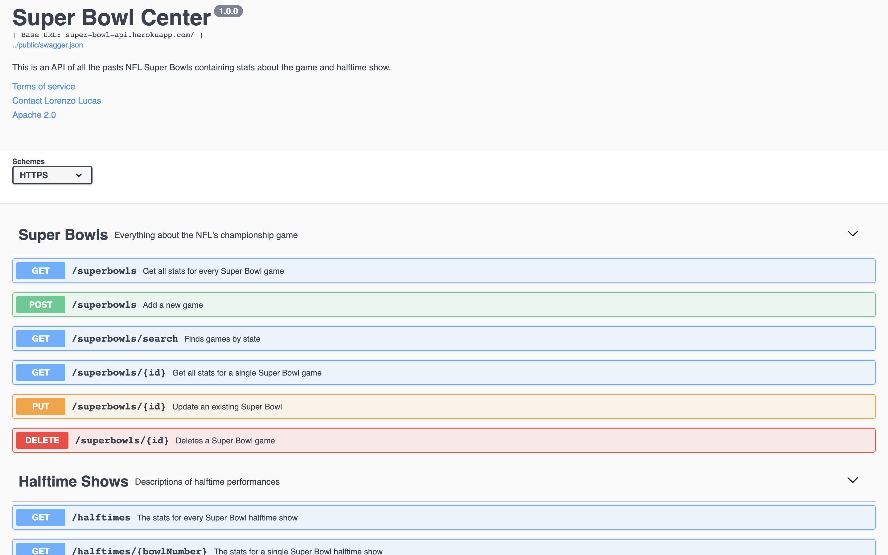
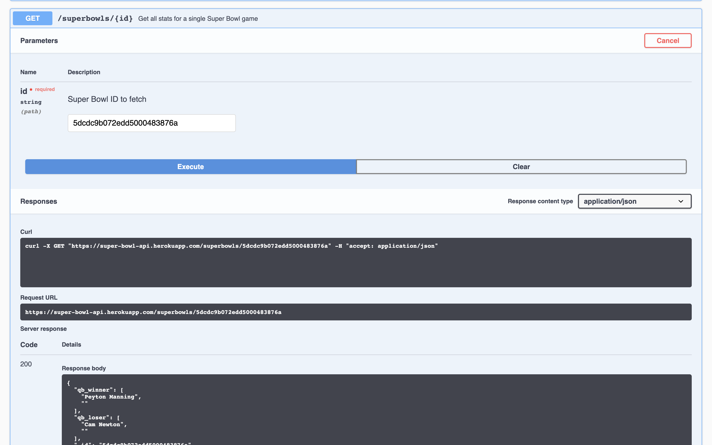

# super-bowl-api

This repository is a Super Bowl Facts API created with ExpressJS and MongoDB. It lists stats about the games, halftime shows, and ratings.

## Screenshots

## Built With

* Javascript/ExpressJS
* MongoDB/Mongoose
* YAML

## Documentation

[Check out the documentation here!](https://app.swaggerhub.com/apis-docs/llucas314/super-bowl_center/1.0.0)

## Contributing

If you have any comments or suggestions please feel free to contact me through github.  

## Future Additions

I would like to improve the searching capabilites.

## Credit

Super Bowl dataset from [Kaggle.com](https://www.kaggle.com/achyutbabu/tv-halftime-shows-and-the-big-game#super_bowls.csv)
Documentation built using [SwaggerHub.com](https://app.swaggerhub.com/search)

## Authors

* Lorenzo Lucas
